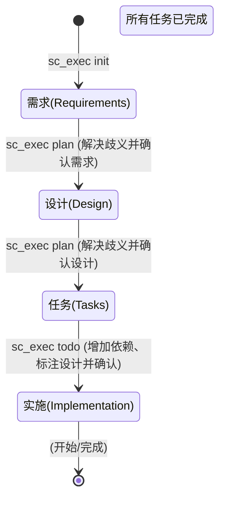

# Spec CLI (MCP)

[](https://www.npmjs.com/package/mcp-spec-cli)
[](https://opensource.org/licenses/MIT)
[](https://modelcontextprotocol.com)

[English](README.md) | [简体中文](README-zh.md)

**Spec CLI** 是一个具备“状态感知”能力的 Model Context Protocol (MCP) 服务器。它能将您的 AI 助手转化为资深产品工程师，通过提供一个稳健的、"开箱即用"的工作流，引导 AI 按照 **需求 → 设计 → 任务** 的标准流程系统性地完成软件开发，在此过程中最大程度减少 Token 消耗并赋予 AI 最高自治权。

## 为什么选择 Spec CLI？

传统的 AI 编程通常会导致上下文丢失、实现偏离目标以及需求被遗忘。`mcp-spec-cli` 通过以下方式解决了这些问题：

*   **状态感知与自动驾驶：** 工具确切知道项目当前所处的阶段。AI 不需要自行跟踪目前是在进行“需求分析”还是“架构设计”——只需调用 `sc_exec plan`，工具会自动处理状态切换。
*   **自主歧义检查：** 在记录需求和设计后，工具会明确指示 AI 在进入下一阶段之前，先行检查并自行解决任何歧义或不确定性。
*   **智能任务组织：** 在初步编写任务文档后，工具会执行“刷新”步骤。它会组织具有明确依赖关系的任务，建立合理的执行顺序，并添加指向需求和设计文档的交叉引用注释。
*   **模糊路径解析：** AI 不需要费力寻找项目文件夹位置。只需输入 `sc_exec plan`，工具就会通过最近活动的功能记录 (`.spec_last_used`) 即时定位上下文。
*   **"GPS" 导航系统：** 在每次工具调用结束时，`mcp-spec-cli` 会输出明确的“下一步”指令。这种机制让工具变成了自动导航的 GPS，极大地减少了对冗长系统提示词的依赖。
*   **基于 Lexer 的可靠性：** 使用稳健的 Markdown 词法分析器（由 `marked` 驱动）代替脆弱的正则表达式来解析和手术级更新文档。这确保了任务复选框被准确更新，而不会破坏其他格式。

## 工作流图表



## 4 个语义化核心工具

| 工具名称 | 作用 | 参数示例 |
| :--- | :--- | :--- |
| `sc_exec` | 主要工作工具。执行 init, plan, todo 操作。 | `{"action": "init", "flags": {"name": "auth-system"}}` |
| `sc_status` | 返回健康检查状态及后续步骤建议。 | `{}` |
| `sc_help` | 了解如何使用 CLI 工具并获取深度文档。 | `{"topic": "exec"}` |
| `sc_verify` | 用于验证上一步操作是否成功的专用工具。 | `{"feature": "auth-system"}` |

## 命令参考

| 命令 | 描述 |
| :--- | :--- |
| `mcp-spec-cli exec init --name <feature>` | 初始化一个新的 spec 文件夹。 |
| `mcp-spec-cli status` | 检查当前进度。 |
| `mcp-spec-cli help` | 显示帮助文档。 |

## 安装与配置指南

### 前置条件
* **Node.js**: 18.0.0 或更高版本。
* **包管理器**: npm, yarn, 或 pnpm。

### 安装选项

#### 选项 1: 快速开始 (npx)
无需全局安装直接运行：
```bash
npx -y mcp-spec-cli@latest
```

#### 选项 2: 全局安装
如需作为独立的 CLI 工具频繁使用：
```bash
npm install -g mcp-spec-cli
```

#### 选项 3: MCP 客户端配置
为了与 AI 助手配合使用，请将其添加到您的配置文件中：

**Claude Desktop**
添加到 `~/Library/Application Support/Claude/claude_desktop_config.json` (macOS) 或 `%APPDATA%\Claude\claude_desktop_config.json` (Windows):
```json
{
  "mcpServers": {
    "mcp-spec-cli": {
      "command": "npx",
      "args": ["-y", "mcp-spec-cli@latest"]
    }
  }
}
```

**Gemini CLI**
在全局 `~/.gemini/settings.json` 或项目本地 `.gemini/settings.json` 中配置 `mcp-spec-cli`：
```json
{
  "mcpServers": {
    "mcp-spec-cli": {
      "command": "npx",
      "args": ["-y", "mcp-spec-cli@latest"]
    }
  }
}
```
*上下文引导指令 (`GEMINI.md`)：*
为了确保上下文效率，请将以下内容添加到您项目的 `GEMINI.md` 中：
> "You have access to the `mcp-spec-cli` MCP server. Always use `sc_status` to orient yourself before beginning work on a feature. Rely on the `> Next Steps:` output from the tool to guide your workflow transitions autonomously. Keep manual tool usage queries to a minimum."

## 开发指南

### 快速开始

1.  **克隆仓库**:
    ```bash
    git clone https://github.com/benjamesmurray/mcp-spec-cli.git
    cd mcp-spec-cli
    ```
2.  **安装依赖**:
    ```bash
    npm install
    ```
3.  **构建项目**:
    ```bash
    npm run build
    ```
4.  **运行测试**:
    ```bash
    npm test
    ```

### 架构细节
项目近期进行了重构，采用了更易于维护的 **Repository/Service 模式**：
*   **`TaskLexer`**: 使用 `marked` 进行稳健的 Markdown 标记提取。
*   **`MarkdownTaskUpdater`**: 使用词法分析器位置数据进行手术级复选框更新。
*   **`TaskParser`**: 层次化任务结构生成。
*   **Repositories**: 专门的加载器，用于处理源自 OpenAPI 规范的模板、工作流状态和指导数据。

## 许可证
MIT
