# Spec CLI (MCP)

[](https://www.npmjs.com/package/mcp-spec-cli)
[](https://opensource.org/licenses/MIT)
[](https://modelcontextprotocol.com)

[English](README.md) | [简体中文](README-zh.md)

**Spec CLI** is a state-aware Model Context Protocol (MCP) server that transforms your AI agent into a spec-driven product engineer. It provides a robust, zero-shot "just works" workflow that guides AI to systematically move from **Requirements → Design → Tasks** with minimal token usage and maximum autonomy.

## Why Spec CLI?

The traditional approach to AI coding often leads to scope creep and forgotten requirements. `mcp-spec-cli` fixes this by providing:

*   **State-Aware Autopilot:** The tool knows exactly what stage the project is in. The AI doesn't have to track whether it's doing "Requirements" or "Design"—it just calls `sc_exec plan` and the tool handles the transition automatically.
*   **Autonomous Ambiguity Check:** After documenting requirements and design, the tool explicitly instructs the AI to check for and resolve any ambiguities or uncertainties itself before proceeding to the next stage.
*   **Intelligent Task Organization:** After the initial task document is written, the tool performs a "refresh" step. It organizes tasks with clear dependencies, establishes a sensible execution order, and annotates them with cross-references to the requirements and design documents.
*   **Persistent Task-Epoch Memory:** A "short-term memory" system (`.epoch-context.md`) that tracks active focus, pending intentions, and hypotheses. This ensures that if an AI session is interrupted or closed, the next session resumes with perfect context of "what was I just doing?"
*   **Human-in-the-Loop Robustness:** Enforces a strict "Ask -> Approve -> Confirm" cycle. The AI is instructed to check for ambiguities and seek explicit user approval before the system allows transitioning to the next workflow phase.
*   **The "GPS Breadcrumb" System:** At the end of every tool call, `mcp-spec-cli` outputs an explicit "Next Step" directive. This turns the tool into an autonomous GPS, heavily reducing the need for lengthy system prompts.
*   **Lexer-Guided Reliability:** Uses a robust Markdown lexer (powered by `marked`) instead of fragile Regular Expressions to parse and surgically update documents. This ensures task checkboxes are updated accurately without corrupting other formatting.

## Workflow Diagram

```mermaid
stateDiagram-v2
    direction TB

    state "Phase 1: Requirements" as REQ {
        [*] --> InitReq: sc_exec init
        InitReq --> EditReq: AI Drafts & Updates
        EditReq --> CheckUncertainty: Update Epoch Context
        CheckUncertainty --> AskUser: "Does this look good?"
        AskUser --> ConfirmReq: User Approves
        ConfirmReq --> [*]: sc_exec plan
    }

    state "Phase 2: Design" as DES {
        [*] --> ScaffoldDes: Reset Epoch Context
        ScaffoldDes --> Research: AI Research & Drafts
        Research --> CheckUncertaintyDes: Update Epoch Context
        CheckUncertaintyDes --> AskUserDes: "Does this look good?"
        AskUserDes --> ConfirmDes: User Approves
        ConfirmDes --> [*]: sc_exec plan
    }

    state "Phase 3: Implementation Planning" as TSK {
        [*] --> ScaffoldTasks: Reset Epoch Context
        ScaffoldTasks --> RefreshTasks: Add Dependencies & Refs
        RefreshTasks --> AskUserTasks: "Does this look good?"
        AskUserTasks --> ConfirmTasks: User Approves
        ConfirmTasks --> [*]: sc_exec plan
    }

    state "Phase 4: Implementation" as IMP {
        [*] --> StartTask: sc_exec todo start
        StartTask --> Work: Coding & Epoch Updates
        Work --> CompleteTask: sc_exec todo complete
        CompleteTask --> [*]: All Tasks [x]
    }

    state "Phase 5: User Testing" as TST {
        [*] --> ScaffoldTest: sc_exec plan
        ScaffoldTest --> ExecuteTest: User Runs Tests
        ExecuteTest --> Feedback: Record User Feedback
        Feedback --> ConfirmTest: Feedback Addressed
        ConfirmTest --> [*]: sc_exec plan
    }

    REQ --> DES
    DES --> TSK
    TSK --> IMP
    IMP --> TST
    TST --> [*]: Feature Delivered
```



## The 4 Semantic Tools

| Tool Name | Purpose | Example Arguments |
| :--- | :--- | :--- |
| `sc_exec` | The primary workhorse tool. Performs init, plan, todo actions. | `{"action": "init", "flags": {"name": "auth-system"}}` |
| `sc_status` | Returns a health check and next steps. | `{}` |
| `sc_help` | Learn how to use the CLI tools and get deep documentation. | `{"topic": "exec"}` |
| `sc_verify` | A dedicated tool to validate that the last action worked. | `{"feature": "auth-system"}` |

## Command Reference

| Command | Description |
| :--- | :--- |
| `mcp-spec-cli exec init --name <feature>` | Initialize a new spec folder. |
| `mcp-spec-cli status` | Check current progress. |
| `mcp-spec-cli help` | Show help documentation. |

## Installation & Setup

### Prerequisites
* **Node.js**: Version 18.0.0 or higher.
* **Package Manager**: npm, yarn, or pnpm.

### Installation Options

#### Option 1: Quick Start (npx)
Run it without installing globally:
```bash
npx -y mcp-spec-cli@latest
```

#### Option 2: Global Installation
For frequent use as a standalone CLI:
```bash
npm install -g mcp-spec-cli
```

#### Option 3: MCP Client Configuration
To use this with AI assistants, add it to your configuration file:

**Claude Desktop**
Add to `~/Library/Application Support/Claude/claude_desktop_config.json` (macOS) or `%APPDATA%\Claude\claude_desktop_config.json` (Windows):
```json
{
  "mcpServers": {
    "mcp-spec-cli": {
      "command": "npx",
      "args": ["-y", "mcp-spec-cli@latest"]
    }
  }
}
```

**Gemini CLI**
Configure `mcp-spec-cli` globally in `~/.gemini/settings.json` or locally in `.gemini/settings.json`:
```json
{
  "mcpServers": {
    "mcp-spec-cli": {
      "command": "npx",
      "args": ["-y", "mcp-spec-cli@latest"]
    }
  }
}
```

**Claude Code**
```bash
claude mcp add mcp-spec-cli -s user -- npx -y mcp-spec-cli@latest
```

## Development

### Getting Started

1.  **Clone the Repo**:
    ```bash
    git clone https://github.com/benjamesmurray/mcp-spec-cli.git
    cd mcp-spec-cli
    ```
2.  **Install Dependencies**:
    ```bash
    npm install
    ```
3.  **Build the Project**:
    ```bash
    npm run build
    ```
4.  **Run Tests**:
    ```bash
    npm test
    ```

### Architecture Details
The project has been recently refactored to use a more maintainable **Repository/Service pattern**:
*   **`TaskLexer`**: Robust Markdown token extraction using `marked`.
*   **`MarkdownTaskUpdater`**: Surgical checkbox updates using lexer position data.
*   **`TaskParser`**: Hierarchical task structure generation.
*   **Repositories**: Specialized loaders for Templates, Workflow State, and Guidance data derived from the OpenAPI spec.

## License
MIT
